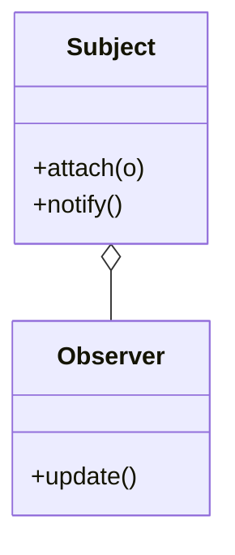

## Các bước bắt đầu

1. Tạo một repo trên GitHub, ví dụ `180-days-challenge`. Nên để public (xem lý do bên dưới).
2. Dựng khung thư mục và mẫu note như phần [Cấu trúc đề xuất](#cấu-trúc-đề-xuất).
3. Đọc các bài [nền tảng](/fundamentals) theo thứ tự. Mỗi bài viết một note ngắn vào `fundamentals/`.
4. Làm [ngày 1](/challenges/1.mang-va-danh-sach). Xong thì ghi note, cập nhật bảng tiến độ, commit.
5. Lặp lại mỗi ngày. Nếu có thể, quay thêm video giải thích.

## Vì sao cần repo riêng

Web này tĩnh. Không tài khoản, không lưu tiến độ. Repo của bạn là nơi duy nhất ghi lại bạn đã làm gì.

Một repo tốt trả lời được ba câu hỏi chỉ trong 30 giây:

- Đang ở ngày thứ mấy?
- Ngày X đã học gì, code ở đâu, hiểu tới đâu?
- Có ngày nào bỏ dở không?

## Cấu trúc đề xuất

```text
180-days-challenge/
├── README.md                  # Giới thiệu + bảng tiến độ
├── fundamentals/              # Note các bài nền tảng
│   ├── big-o-notation.md
│   └── de-quy.md
├── days/
│   ├── 001-mang-va-danh-sach/
│   │   ├── README.md          # Note của ngày: hiểu gì, sai gì, trả lời câu hỏi ôn tập
│   │   ├── src/               # Code bài tập
│   │   ├── tests/             # Test tự viết
│   │   └── diagrams/          # Hình vẽ: .excalidraw, .svg, .png
│   ├── 002-.../
│   └── ...
└── templates/
    └── day.md                 # Mẫu note, copy mỗi ngày
```

Mấy quy ước nhỏ nhưng quan trọng:

- **Tên thư mục = số ngày 3 chữ số + slug trên web.** Ngày 1 là `001-mang-va-danh-sach`. Đánh 3 chữ số thì `ls` và GitHub tự sắp đúng thứ tự, ngày 10 không bị xếp trước ngày 2.
- **Mỗi ngày một thư mục độc lập.** Có file build riêng (Makefile, `package.json`, ...) nếu cần. Ngày 50 không được làm hỏng code ngày 5.
- **Note nằm cạnh code.** `README.md` trong thư mục ngày sẽ hiện luôn khi mở thư mục đó trên GitHub.

## Mẫu note mỗi ngày

Copy `templates/day.md` sang thư mục ngày mới rồi điền vào. Viết bằng lời của mình, không copy từ web.

```md
# Ngày 001: Dynamic Array

- Đề: https://180-days-challenge.vercel.app/challenges/1.mang-va-danh-sach
- Thời gian: 75 phút
- Video: (link YouTube nếu có)

## Ý chính (tự diễn đạt lại)

## Diagram

## Chỗ mình sai / bị kẹt và cách gỡ

## Trả lời câu hỏi ôn tập

## Còn chưa hiểu
```

Mục "Chỗ mình sai" có giá trị nhất. Ba tháng sau đọc lại, bạn sẽ thấy mình đã tiến bộ tới đâu.

## Theo dõi tiến trình

### Bảng tiến độ trong README

Đặt bảng này ở README gốc. Mỗi ngày xong thì thêm một dòng:

```md
| Ngày | Chủ đề                    | Trạng thái | Note                               | Video     |
| ---- | ------------------------- | ---------- | ---------------------------------- | --------- |
| 001  | Dynamic Array             | ✅         | [note](days/001-mang-va-danh-sach) | [▶️](link) |
| 002  | Linked List               | 🚧         | [note](days/002-...)               |           |
| 003  | Stack                     | ⬜         |                                    |           |
```

✅ xong, 🚧 đang làm, ⬜ chưa làm. Nhìn cột trạng thái là biết ngay mình đang ở đâu.

### Commit mỗi ngày

- Ít nhất một commit mỗi ngày học. Ô xanh trên contribution graph của GitHub chính là chuỗi ngày học của bạn.
- Message ghi rõ ngày: `day 001: dynamic array push/insert/erase`, `day 001: note + diagram resize`.
- Muốn xem lại cả ngày: `git log --oneline --grep "day 001"`.

Commit nhỏ, commit nhiều. Lịch sử commit cho thấy bạn đã đi từ code sai tới code đúng thế nào. AI không làm giả được thứ đó.

## Vẽ diagram trong repo

Vẽ ra là cách nhanh nhất để biết mình hiểu thật hay chưa. Nên vẽ: con trỏ của linked list, cây sau mỗi lần xoay, bảng DP, class diagram của pattern.

- **Mermaid**: viết diagram bằng text ngay trong file `.md`, GitHub tự render. Hợp với flowchart, class diagram, sequence diagram.
- **Excalidraw**: vẽ tay tự do. Lưu file `.excalidraw` để sửa lại được, export thêm `.svg` để nhúng vào note.

Ví dụ Mermaid cho Observer pattern:

````md

````

Nhúng hình Excalidraw vào note: ``.

## Public repo để mọi người cùng học

Nếu được, hãy để repo **public**. Lợi ích:

- **Có người nhìn thì khó bỏ cuộc.** Repo public là một lời cam kết.
- **Người đi sau học được từ note và cả chỗ sai của bạn.** Họ thấy rõ con đường, không chỉ thấy đáp án.
- **Thành portfolio thật.** 180 ngày commit đều đặn thuyết phục nhà tuyển dụng hơn mọi dòng tự giới thiệu trong CV.

Vài lưu ý khi public:

- Thêm topic `180-days-challenge` cho repo trên GitHub để người khác dễ tìm.
- Thêm `LICENSE` (ví dụ MIT) để người khác biết họ được dùng lại code của bạn tới đâu.
- Không commit key, token, mật khẩu hay dữ liệu cá nhân. Dùng `.gitignore` và file `.env` không commit.
- Đọc repo người khác sau khi đã tự làm xong, không phải trước khi làm. Luật "tự code bằng tay" vẫn áp dụng.

## Quay video YouTube

Không bắt buộc, nhưng rất đáng làm. Giải thích được cho người khác nghĩa là mình hiểu thật. Đây là phép thử mạnh nhất để kiểm tra chuyện đó.

Mỗi video giải thích lại bài từ đầu đến cuối, như đang dạy cho một người chưa biết gì. Xong phần giải thích mới kể lại những chỗ mình sai. Dài 10-20 phút, chia làm hai phần:

### Phần 1: Giải thích từ đầu đến cuối

1. **Bài toán (1 phút).** Đề yêu cầu gì, đầu vào, đầu ra, ràng buộc. Nêu một ví dụ cụ thể.
2. **Vì sao cần nó (1 phút).** Cách ngây thơ nhất là gì, chậm hay tệ ở đâu.
3. **Ý tưởng (3-5 phút).** Vẽ diagram, cho chạy tay trên ví dụ nhỏ từng bước. Đây là phần quan trọng nhất.
4. **Độ phức tạp (1-2 phút).** Thời gian và bộ nhớ, giải thích vì sao ra con số đó chứ không chỉ đọc kết quả.
5. **Code (3-5 phút).** Đi qua code của mình theo đúng thứ tự vừa giải thích. Không đọc từng dòng, chỉ nói những đoạn chứa ý tưởng.
6. **Chạy test (1 phút).** Chạy test, chỉ ra các case biên: rỗng, một phần tử, rất lớn.

### Phần 2: Những lỗi mình đã mắc

1. **Lỗi sai.** Mở lại commit hoặc đoạn code sai, cho người xem thấy nó chạy sai thế nào.
2. **Vì sao sai.** Mình đã hiểu nhầm điều gì. Đây mới là thứ người xem cần học, không phải bản thân con bug.
3. **Cách phát hiện.** Nhờ test nào, lần debug nào, hay nhờ vẽ lại diagram.
4. **Bài học.** Một câu ngắn để lần sau không lặp lại.

Kết video bằng một câu còn chưa hiểu hoặc câu hỏi mở cho người xem.

Phần 2 lấy thẳng từ mục "Chỗ mình sai / bị kẹt" trong note. Viết note kỹ thì quay nhanh.

Không cần quay đẹp. Màn hình + giọng nói là đủ. Dán link video vào note ngày đó và vào cột Video của bảng tiến độ. Có thể gom thành playlist "180 Days Challenge" để theo dõi.

Note + diagram + video của cùng một ngày bổ trợ cho nhau: note để tra cứu nhanh, diagram để nhìn cấu trúc, video để nghe giải thích.
